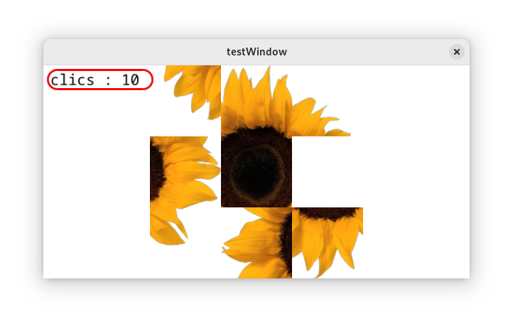
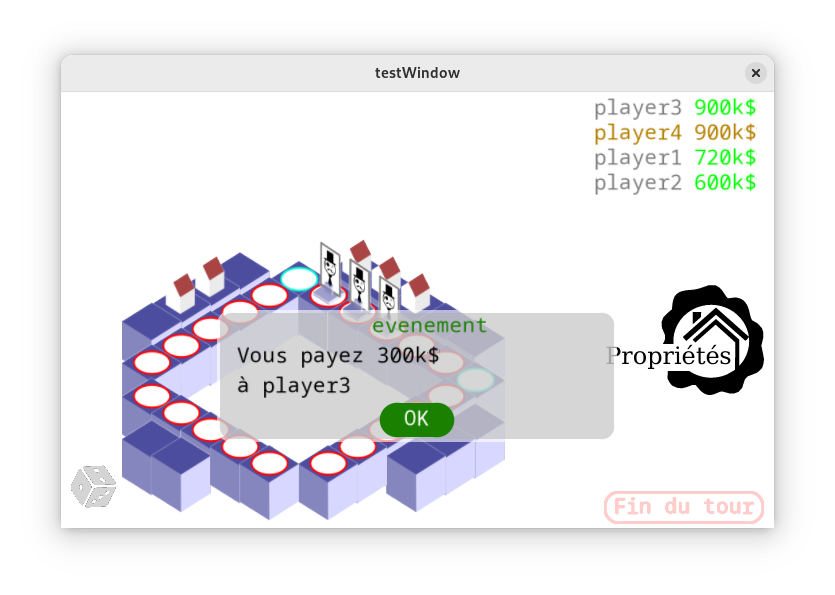

# Olygopol7

Ce projet a été réalisé en tant que projet long de l'UE « Technologie Objet » de la première année de l'école d'ingénieur Enseeiht.

Il a consisté en la réalisation d'un **moteur de jeu 2D en java avec OpenGl** puis en la réalisation d'un
**jeu de taquin** et d'un **jeu de monopoly utilisant ce moteur**.

Vous trouverez plus de détails en lisant les rapports de projet dans le dossier "livrables" et
la présentation orale "presentation.pdf" qui ont participé à la notation du projet.

## Ressources utiles

- [Rapport final du projet](./livrables/rapport3.pdf)
- [Présentation du projet](./livrables/presentation.pdf)
- Les diagrammes UML du projet dans le dossier doc/architectures

## Utilisation

Le projet a été testé avec succès sur linux (fedora, debian, ubuntu) et windows 10.
Le projet n'a jamais été testé sur macos mais pourrait potentiellement fonctionner.

**Les consignes suivantes sont pour Linux :**

1. Installer java sur votre ordinateur et s'assurer qu'il est présent dans le path. Vous devez avoir java > 15, vous pourrez vérifier en tapant `java --version` dans le terminal.
2. Ouvrez un terminal dans le dossier racine du projet et lancez le script "BUILD.sh" pour télécharger automatiquement les dépendances et compiler le code source java
(sur windows vous devrez taper à la main les commandes dans le script BUILD.sh ou adapter celui-ci au langage bash de windows)
3. Vous pouvez tester le projet en lançant le fichier RUN.sh
4. L'archive "Olygopol7.tar" contient tous les fichiers nécessaires pour lancer le projet compilé sur n'importe quelle machine. Vous pouvez copier celui-ci et l'envoyer à vos amis pour qu'ils puissent essayer.

## Commande du RUN.sh

Vous pouvez lancer le fichier RUN.sh de 3 façon :
1. ./RUN.sh -> lancer le jeu de monopoly, les pseudos des 4 joueurs de la partie seront demandé à l'utilisateur par le script
2. ./RUN.sh joueur1 joueur2 joueur3 joueur3 -> lancer le jeu de monopoly avec joueur1-2-3-4 qui sont les pseudos des joueurs de la partie
3. ./RUN.sh --taquin -> lancer le jeu de taquin

## Remarques

Ce projet est loin d'être fini, il manque beaucoup de fonctionnalités :
- une partie simplifiée de monopoly fonctionne mais il manque la case prison, les hypothèques...
- le jeu de taquin n'est pas mélangé à chaque partie et il n'y a pas de détection lorsque l'image est reconstruite
